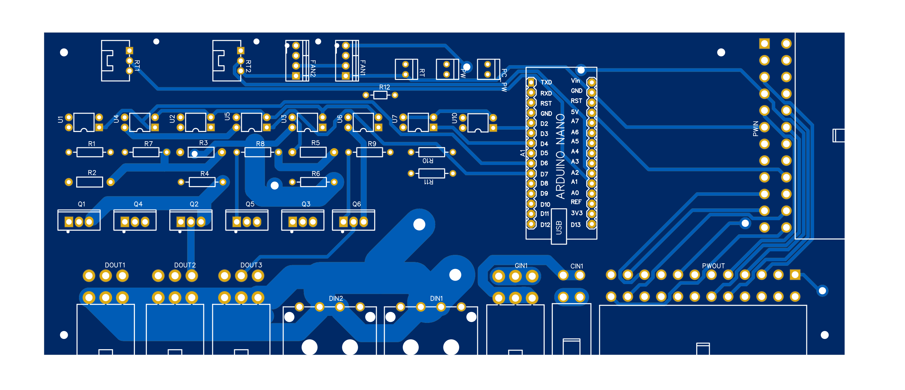

## 项目介绍

这是一个自制 NAS 的项目，包括机箱和一部分控制程序。

初步版本为一个 6 盘位 NAS 机箱，外壳 270\*210\*330 ，最大支持 ATX 主板，支持半高 PCIE 卡，支持 FLEX 电源。

硬盘垂直放置，垂直风道，正压散热，散热和防尘效果杠杠的。

风扇根据温度探头自动运行，支持自动调节和手动调节。

使用 arduino 控制 NAS 的行为，硬盘分批启动，防止因电流过大造成启动失败。

## 仓库介绍

本仓库主要有以下几部分构成

### 图纸

> 图纸部分尚未完成

机箱图纸，整个机箱使用 5mm 亚克力板切割，建议使用黑色或者骚红。

装配表待添加。

### PCB 板

> 已完成，尚未验证

主要是启动行为的控制部分。

注：PCB 板非实时渲染，以图纸为准。

### 控制程序

> 已完成，尚未验证

使用 Arduino 控制 NAS 的启动行为，实现一系列高级功能。

## 特点

- 6 盘位 NAS 机箱
- 最大支持 ATX 主板，兼容性好
- 支持半高 PCIE 卡(不支持全高)
- 多 PCIE 插槽可用，可同时插 SATA 扩展卡和万兆网卡
- 硬盘分批启动
- 自动或手动调整机器风扇转速

## 计划中

- 8 盘位版本
- 可配置的上电自启功能
- 小型 UPS 功能

## 说明

目前这个项目尚未完成，在验证可行性之前请勿使用。

## QQ 群

说明：

QQ 群为定制讨论群，有一部分资料，还有打样的板子也可以在群里找到。

972313206
