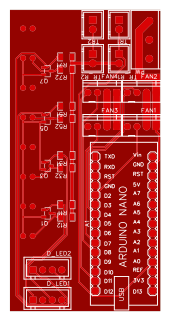
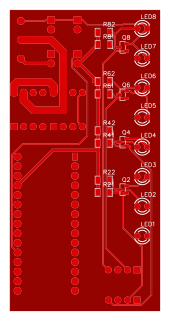

# 硬盘指示灯

兼顾硬盘读写指示和机箱风扇控制功能。

> 目前 PCB 板有缺陷，风扇测速功能不可用，如介意请自行修改(因为我用不到这个功能，不打算修改了，加功能又要改 PCB 尺寸)

## 说明

- 如不需要修改，直接下载`Gerber`文件，直接下单 PCB 打样即可。

## 预览

非实时，详情请以实际为准。

 

## BOM

非标准 BOM 表，方便购买

- `接线端子` 5.08MM 3P
- `连接器端子` XH2.54 2P 4P
- `连接器端子` 2510 2.54 风扇专用
- `LED灯珠` 3mm
- `三极管` S9018 SOT-23
- `电阻` 1206 33K 150R 或 200R
