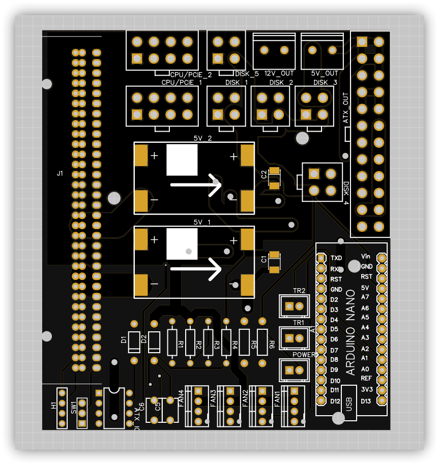
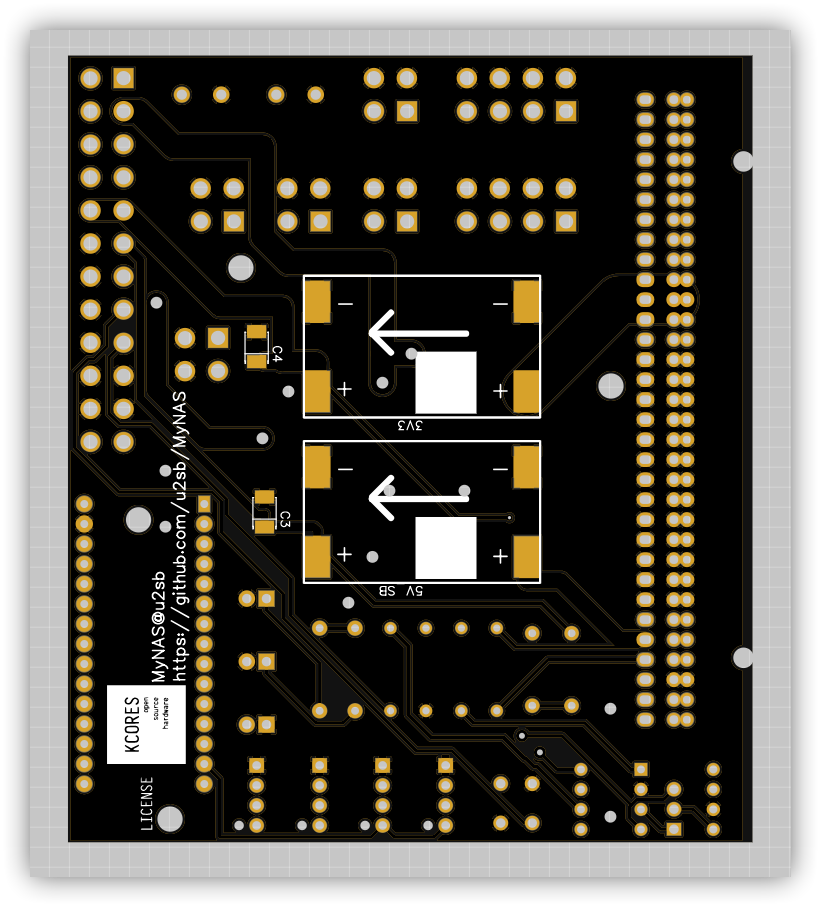
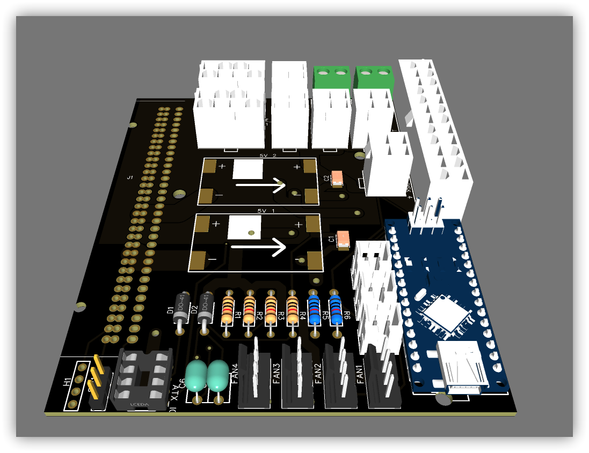

## DC2ATX

基于 [KCORES-CSPS-to-ATX-Converter](https://github.com/KCORES/KCORES-CSPS-to-ATX-Converter) 修改的一个适合 NAS 使用的 DC-ATX 转接板。

相比原版，拥有以下特点

1. 重新定义了硬盘供电线序，并且拥有更多的硬盘供电接口
2. 硬盘 5V 独立供电，拥有更大的 5V 输出能力，硬盘供电 5V 最大输出 5A，主板供电 5V 最大输出 5A
3. 集成温度控制和风扇调速功能

## 说明

- 如不需要修改，直接下载`Gerber`文件，直接下单 PCB 打样即可。

## 注意事项

- 注意事项参见 [KCORES-CSPS-to-ATX-Converter](https://github.com/KCORES/KCORES-CSPS-to-ATX-Converter)
- 如需更强大的 5V 供电能力，请自行飞线替代 mini560 模块，5v_2 对应硬盘供电，5v_1 对应主板 5V 供电
- R5 和 R6 为测温分压电阻，标准阻值 8.2K，可自行接可调电阻做手动调节，建议使用 5K 左右的电阻串联一个和 10K 左右电阻并联的 10K 可调电阻(提供 5-10K 的可调范围)，如需更多温控需求，请修改[控制程序](../../控制程序/Fan/README.md)
- 禁止将两个 5V 模块直接短接

## 预览

  

## LICENSE

[kcores-license](../LICENSE)
